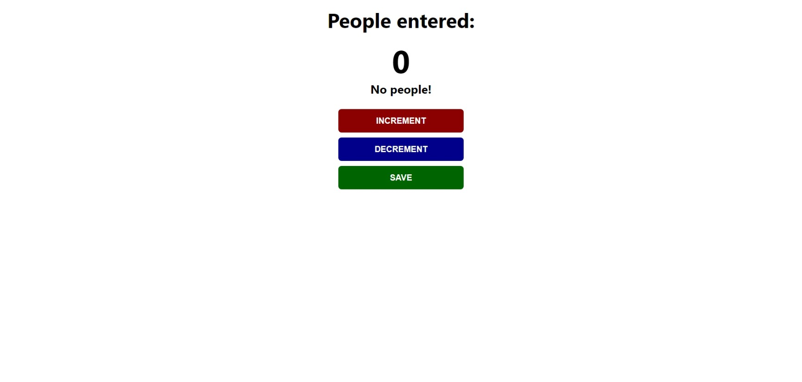

# Scrimba - JavaScript Free Course (Build A Passenger Counter App)

This is my code of the "Build A Passenger Counter App" challenge of Scrimba.

## Table of contents

- [Overview](#overview)
  - [The challenge](#the-challenge)
  - [Screenshot](#screenshot)
  - [Links](#links)
- [My process](#my-process)
  - [Built with](#built-with)
- [Author](#author)

## Overview

### The challenge

Build an interactive app that counts and shows the number of people in a station. App should:

- have a button which increments and show the number of people.
- shows the previous entries.

### Screenshot

### Links

- Live Site URL:
  --->[LINK](https://godkingjay.github.io/SCRIMBA-JS-Passenger-Counter-App/)

## My process

### Built with

- Semantic HTML5 markup
- CSS custom properties
- Flexbox
- Javascript

## Author

- Twitter - [@godking_jay](https://www.twitter.com/godking_jay)
